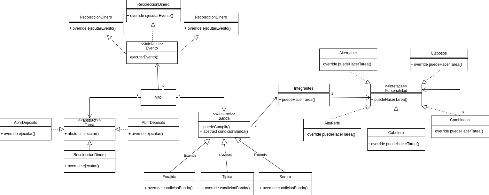



**El Tío Cosa... Nostra**

Nuestro tío Vito necesita ayuda: son tiempos nuevos, y necesita una aplicación para manejar a sus muchachos, o como les dice él: “muchaches”. La idea es construir un modelo e implementar el código necesario para asegurarse de poder continuar normalmente con la operatoria, descripta en los párrafos siguientes.

# **Tareas**
Vito recluta grupos de personas que tienen a su cargo diferentes tareas:

- **recolectar el dinero a los comerciantes a cambio de protección:** esto implica pasar por un negocio y pedirle un 10% de las ventas obtenidas en el mes (eso depende de cada comerciante).
- **abrir un depósito:** el negocio inmobiliario de Vito requiere abrir depósitos, que se los compran a otras personas. Pagan $ 100 por metro cuadrado (depende del tamaño del depósito).  
- **prestar dinero:** Vito es muy generoso y presta dinero a ciertas personas. La banda le lleva el dinero la primera vez, y a partir de allí, se generan 4 tareas para ir a cobrar el dinero, asegurándose de que el monto de las 4 cuotas sea el doble de lo prestado. Ejemplo: Vito le presta a Fabrizio 100 $ el 05/07/2020, en el momento en que se entreguen se generarán 4 tareas para cobrarle a Fabrizio $ 50, los días 05/08/2020, 05/09/2020, 05/10/2020 y 05/11/2020. 
- **cobrar cuota del dinero prestado:** mencionado en el punto anterior.

Cosas comunes que involucran a las tareas:

- están asociadas a un mes, por convención se marcan siempre con el quinto día. Por ejemplo la tarea que hay que hacer en julio del 2020 lleva la fecha *05/07/2020*
- las tareas están pendientes hasta que se ejecutan y se marcan como cumplidas.
- para las tareas que implican recibir dinero, cada grupo (llamado “banda”) se queda como gasto administrativo con un 20%. El resto se rinde a Vito tan pronto se ejecuta exitosamente la tarea, es decir cada banda contabiliza el total que le queda a ella y el total que debe rendirle a Vito. 
- Las tareas que implican gastos salen siempre de la cuenta de Vito: cuando presta plata es él al que le quitan y es él el que paga cuando se abre un depósito.

# **Integrantes de una banda**
Cada miembro de una banda tiene diferente personalidad, que define si quiere hacer o no una tarea:

- **alto perfil:** quieren que la banda esté en negocios grandes para ganar notoriedad, no aceptan que la banda cobre menos de $ 1.000 para hacer una tarea.
- **culposos:** tienen conciencia social, no pueden cobrar plata si la persona involucrada en la tarea tiene ingresos mensuales inferiores a $ 5.000.
- **alternantes:** los meses impares son de alto perfil, los meses pares son culposos.
- **cabuleros:** no tienen problemas a menos de que la persona involucrada en la tarea tenga una X en su nombre: no pueden prestarle a Patxi ni abrir un depósito si el que lo vende se llama Xavier.
- **combinada:** es la combinación de 2 ó más personalidades, en cuyo caso para aceptar una tarea se tienen que cumplir todas las condiciones impuestas por las personalidades.

La personalidad debe poder modificarse dinámicamente, de manera de pasar de alto perfil a cabulero sin mayores problemas.

# **Circuito del negocio**
- Al comienzo del mes, Vito crea las tareas para hacer en base a su conocimiento, y quiere que esto siga siendo así, por lo que la tarea es manual.
- **Proceso de asignación de tareas:** sí le interesa que una vez definidas las tareas para un mes determinado, el sistema le asigne la primera banda que puede cumplir una tarea, esto depende de que la banda no esté en bancarrota (tenga dinero recaudado > 0) y:
  - en el caso de una banda **forajida**, alguno de los integrantes esté de acuerdo con hacer la tarea
  - en la banda **sorora**, todos los integrantes quieran hacer la tarea
  - en la banda **típica**, el líder de la banda quiera hacer la tarea

(una banda una vez creada se comporta siempre de la misma manera en este punto)

- Si alguna de las tareas no es elegida por ninguna banda, el sobrino de Vito hará cambios en los integrantes de las bandas y ejecutará nuevamente el proceso de asignación de tareas (ver punto anterior).
- *Una vez asignadas todas las tareas*, Vito quiere simular la ejecución de todas las tareas. Cada vez que una tarea termine su ejecución
  - debe enviarse una notificación por Whatsapp al número privado de Vito, con el mensaje clave asociada a la tarea. Ejemplo: “La puerca está en la pocilga - $ 500” (indica el cobro por protección a un comerciante por ese valor)
  - si una banda supera el $ 1.000.000 debe informar a la AFIP cada movimiento con el siguiente formato: fecha y hora, tipo de movimiento (1 = ingreso, 2 = egreso), concepto (se suele describir como “VARIOS”) y el importe.
  - el 30% queda para la banda y el resto debe dividirse en partes iguales para cada integrante (incluso para el líder)

(queremos que sea fácil agregar o quitar acciones que ocurren una vez ejecutada una tarea)

Se pide que realice un diagrama de clases de la solución general e implemente el código que permita resolver todo el circuito de la aplicación.

#Diagrama UML



